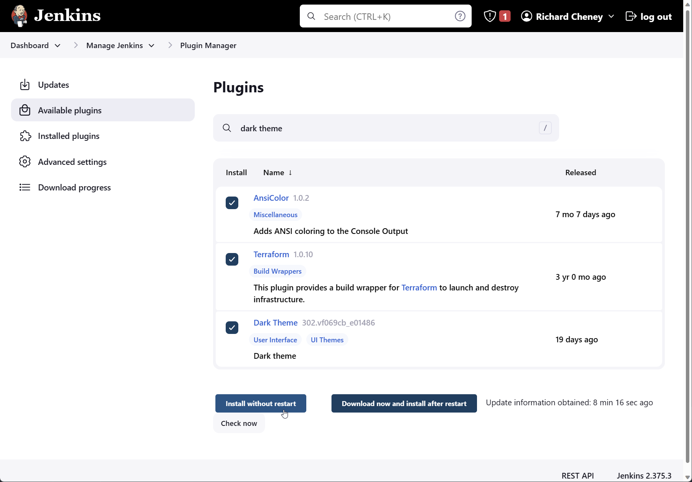
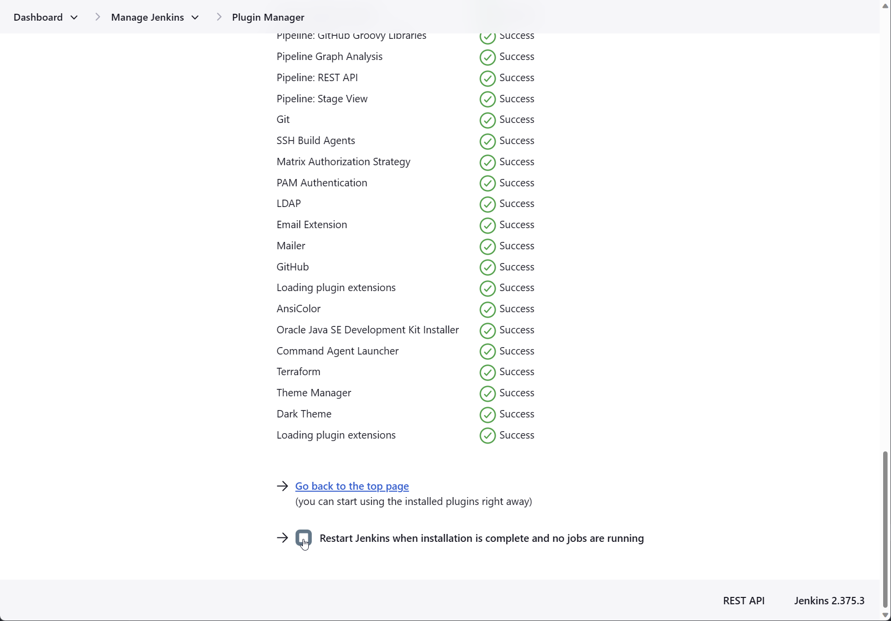
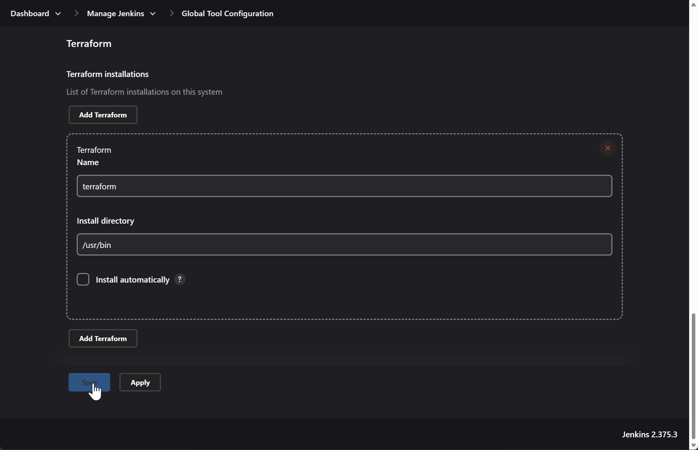
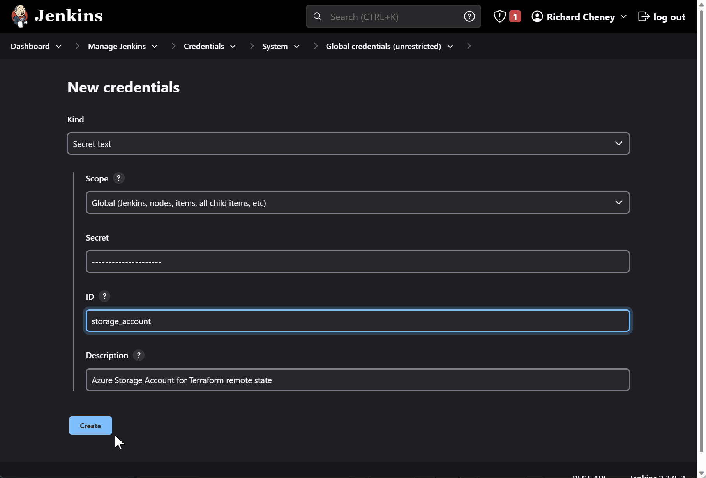
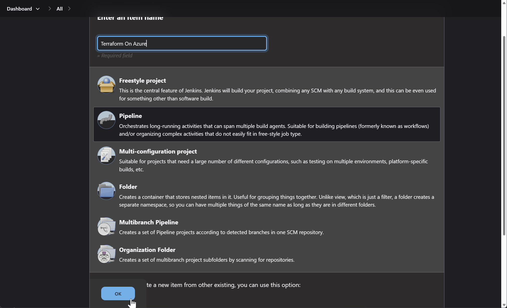
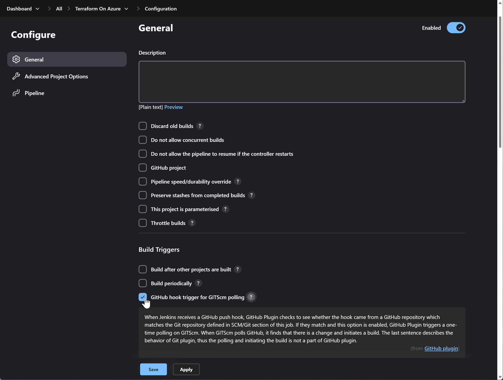
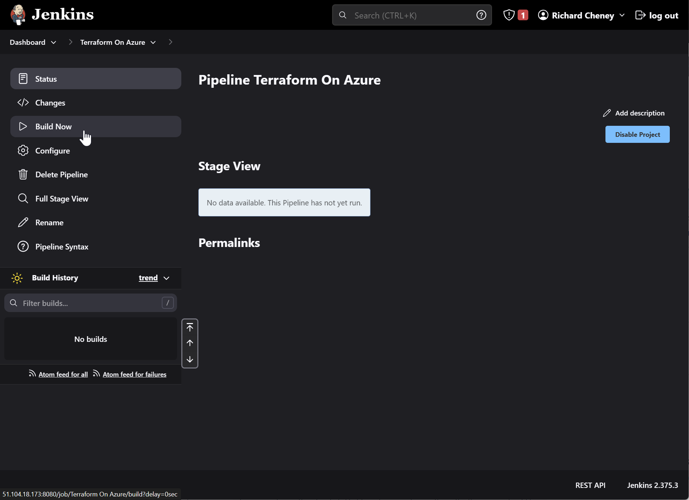
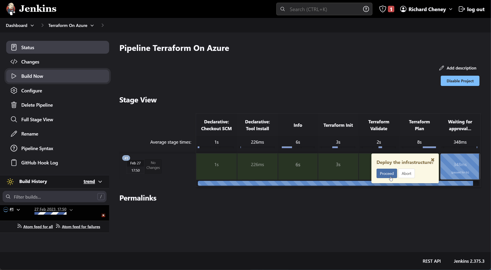
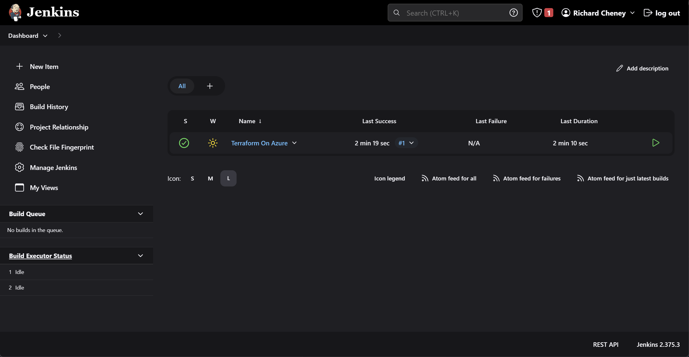
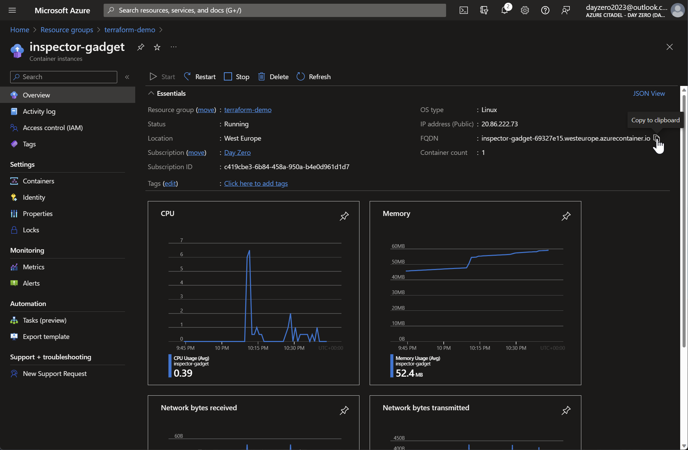

# Jenkins on Azure VM deploying Terraform config

Jenkins is a popular CI/CD tool. This example shows the creation of a Jenkins server with a system assigned managed identity. Azure CLI and Terraform will also be installed. Jeknins is then configured to use the GitHub repo and its Jenkinsfile. The Jenkinsfile includes both Azure CLI and Terraform example steps in the pipeline.

Assumes a Bash environment with the [Azure CLI](https://learn.microsoft.com/cli/azure/install-azure-cli), plus access to a valid subscription.

The terraform config should create a resource group, *terraform-demo*, and an Azure Container Instance running the inspector gadget image, but this is purely to prove that your Terraform configuration can be deployed via Jenkins using a GitHub repo and a system assigned managed identity.

If you are prefer using service principals then check the companion [Service Principal readme](markdown/service_principal.md).

## Forking

Before you start, fork this repo so that you have your own.

## Deploy a Jenkins server

1. Create cloud-config.yaml

    Create a cloud-config.yaml file with the following contents.

    ```yaml
    #cloud-config
    package_upgrade: true
    runcmd:
      - sudo apt install openjdk-11-jre ca-certificates curl apt-transport-https lsb-release gnupg gpg wget -y
      - wget -qO - https://pkg.jenkins.io/debian-stable/jenkins.io.key | sudo apt-key add -
      - wget -qO- https://apt.releases.hashicorp.com/gpg | gpg --dearmor | sudo tee /usr/share/keyrings/hashicorp-archive-keyring.gpg > /dev/null
      - wget -qO- https://packages.microsoft.com/keys/microsoft.asc | gpg --dearmor | sudo tee /usr/share/keyrings/microsoft.gpg > /dev/null
      - sh -c 'echo deb https://pkg.jenkins.io/debian-stable binary/ > /etc/apt/sources.list.d/jenkins.list'
      - sh -c 'echo "deb [arch=`dpkg --print-architecture` signed-by=/usr/share/keyrings/hashicorp-archive-keyring.gpg] https://apt.releases.hashicorp.com `lsb_release -cs` main" | sudo tee /etc/apt/sources.list.d/hashicorp.list'
      - sh -c 'echo "deb [arch=`dpkg --print-architecture` signed-by=/usr/share/keyrings/microsoft.gpg] https://packages.microsoft.com/repos/azure-cli/ `lsb_release -cs` main" | sudo tee /etc/apt/sources.list.d/azure-cli.list'
      - sudo chmod go+r /usr/share/keyrings/hashicorp-archive-keyring.gpg /usr/share/keyrings/microsoft.gpg
      - sudo apt-get update && sudo apt-get install jenkins terraform azure-cli jq -y
      - sudo service jenkins restart
    ```

    The cloud-config.yaml file will install

    * jenkins
    * terraform
    * azure-cli
    * jq

1. Set your default region and resource group

    Set these to your preferred values.

    ```bash
    az config set defaults.location=uksouth defaults.group=jenkins
    ```

    Setting defaults removes the need to specify `--location` and `--resource-group` on Azure CLI commands. Defaults are stored in `~/.azure/config`. Use `az config unset defaults.location defaults.group` to unset.

    See <https://learn.microsoft.com/cli/azure/azure-cli-configuration> for more.

1. Create the resource group

    ```bash
    az group create --name $(az config get defaults.group --query value -otsv)
    ```

1. Create the VM

    ```bash
    az vm create --name jenkins \
    --image UbuntuLTS \
    --admin-username "azureuser" \
    --generate-ssh-keys \
    --public-ip-sku Standard \
    --custom-data cloud-config.yaml \
    --assign-identity [system]
    ```

1. Open port 8080 and 443 on the NSG

    ```bash
    az vm open-port --port 8080 --priority 1010 --name jenkins
    az vm open-port --port 443 --priority 1020 --name jenkins
    ```

## Terraform remote state and identity RBAC

1. Find the objectId for the managed identity

    ```bash
    managed_identity=$(az vm show --resource-group jenkins --name jenkins --query identity.principalId --output tsv)
    ```

1. Create a storage account and container for the Terraform remote state

    ```bash
    rgId=$(az group show --name $(az config get defaults.group --query value -otsv) --query id -otsv)
    sa=terraform$(md5sum <<< $rgId | cut -c1-12)
    az storage account create --name $sa --sku Standard_LRS --allow-blob-public-access false
    az storage container create --name "tfstate" --account-name $sa --auth-mode login
    ```

    Uses md5sum to generate a predictable hash from the resource group's resource ID.

1. Assign RBAC roles for the managed identity

    ```bash
    subscriptionId=/subscriptions/$(az account show --query id --output tsv)
    saId=$(az storage account show --name $sa --query id --output tsv)
    az role assignment create --assignee $managed_identity --role "Contributor" --scope $subscriptionId
    az role assignment create --assignee $managed_identity --role "Storage Blob Data Contributor" --scope $saId
    ```

## SSH to your Jenkins server

1. Grab the public IP address

    ```bash
    publicIp=$(az vm show --name jenkins  --show-details --query publicIps --output tsv)
    echo $publicIp
    ```

1. SSH onto the Jenkins server

    ```bash
    ssh azureuser@$publicIp
    ```

## Initial server config

1. Checks

    ```bash
    terraform --version
    az version
    service jenkins status
    ```

    `CTRL`+`C` to break.

1. Display the Jenkins URL and unlock password

    ```bash
    publicIp=$(curl -sSL -H Metadata:true --noproxy "*" http://169.254.169.254/metadata/loadbalancer?api-version=2020-10-01 \
      | jq -r .loadbalancer.publicIpAddresses[0].frontendIpAddress)
    pwdfile=/var/lib/jenkins/secrets/initialAdminPassword
    echo "Open http://${publicIp}:8080"
    sudo --user=jenkins -- test -s $pwdfile && echo "and paste in $(sudo cat $pwdfile)"
    ```

## Initial UI connection

1. Connect to the URL and paste in the initialAdminPassword

1. Select plugins to install
1. Filter to *GitHub*
1. Check *GitHub*
1. *Install*

    Getting Started will take a few minutes to run.

1. Create First Admin User

   * username
   * password
   * full name
   * email address

1. Save & Finish
1. Start using Jenkins

## Configure Jenkins Plugins

1. Manage Jenkins | System Configuration | Manage Plugins
    1. Click on *Available plugins*
    1. Search for and check the following plug-ins
        * AnsiColor
        * Terraform
        * Dark Theme (optional)
    1. Check and *Install without restart*

        

1. Restart Jenkins

    Once they have all installed then check the *Restart Jenkins* box.

    

    Alternatively:

    * Browse to `http://<ip_address>:8080/restart`, or
    * Run `sudo service jenkins restart`

## Dark mode (optional)

If you installed the Dark Theme plugin:

1. Manage Jenkins | Configure System
1. Scroll down to *Themes*
1. Select your preferred theme

## Jenkins Tools

Jenkins can install tools (binaries, etc) on the fly with automatic installers. We installed Terraform via apt and will use the `/usr/bin/terraform` binary.

1. Manage Jenkins | Global Tool Configuration
1. Scroll down to the Terraform section
1. *Add Terraform*
    1. Name = **terraform**

        For information, the name matches the second field in the Jenkinsfile tools block:

        ```go
        tools {
            'org.jenkinsci.plugins.terraform.TerraformInstallation' 'terraform'
        }
        ```

    1. Install directory = **/usr/bin**
    1. Uncheck *Install automatically*

        
1. Save

## Credential

1. Display values for secrets

    ```bash
    rgId=$(az group show --name $(az config get defaults.group --query value -otsv) --query id -otsv)
    sa=terraform$(md5sum <<< $rgId | cut -c1-12)
    az account show --query "{tenant_id:tenantId, subscription_id:id}" --output yamlc
    az storage account show --name $sa --query "{resource_group:resourceGroup, storage_account:name}" --output yamlc
    ```

1. Manage Jenkins | Manage Credentials
1. *System*, *Global credentials*, *+ Add Credentials*
1. Kind = **Secret text**

    Create credentials for **tenant_id**, **subscription_id**, **resource_group** and **storage_account**, setting *secret* to the values shown by the commands above.

    

    The Jenkinsfile maps the credentials to environment variables.

## Configure a pipeline

### Create the Jenkins pipeline

On the Jenkins dashboard:

1. *+ New Item*
1. Select *Pipeline"
1. Enter an item name

    

1. Click OK

    You will now be in the *Configure | General* screen for your pipeline.

1. Scroll down to Build Triggers section
1. Check *GitHub hook trigger for GITScm polling*

    

1. Scroll down further, to the Pipeline section
1. Change the *Definition* dropdown to *Pipeline script from SCM*

    

1. *SCM* should be set to *Git*
1. In repository URL, add in the .git path to your repo

    ⚠️ Your repo

1. Click on *Add Branch*
1. Set the specifier, e.g. `*/main`

    

    Note that there is a Jenkinsfile at the root of the repo, matching the default Script Path on the configuration.

1. Save

## Trigger the initial test build

Make sure the pipeline works before creating the GitHub webhook. In Jenkins dashboard:

1. Select your pipeline
1. Click on *Build Now*

    

    The pipeline view will start to show in the right hand pane.

1. Approve the deployment

    Assuming the Terraform Init, Terraform Validate and Terraform Plan stages have succeeded, you will be asked to approve the deployment. Feel free to view the log output of the Terraform Plan stage.

    Hover over the *Waiting for approval* stage and you will get the option to *Proceed*.

    

    The final Terraform Apply stage should create the resource group and container instance.

## Success

1. Jenkins dashboard

    The dashboard should now show a healthy pipeline run.

    

1. Azure Portal

    You should now have a resource group called terraform-demo containing the example container instance.

    

    Success!

## Create the GitHub webhook

In your clone of this [GitHub repo](https://github.com/richeney/jenkins):

1. Settings | Webhooks
1. Set the *Payload URL* to `http://<ip_address>:8080/github-webhook/`
1. Set *Content type* to *application/json*

    

1. Click on *Add webhook*

Feel free to locally clone your repo, make a change to the Jenkinsfile or Terraform files and then push that commit back up to the origin. This should trigger another build pipeline.

## Next

OK, it is working. Want to harden it a little?

* [Configure HTTPS](markdown/configuring_https.md)

## Resources

* <https://www.jenkins.io/doc/book/pipeline/jenkinsfile/>
* <https://plugins.jenkins.io/credentials/>
* <https://learn.microsoft.com/azure/developer/jenkins/configure-on-linux-vm>
* <https://learn.microsoft.com/azure/developer/jenkins/deploy-to-azure-spring-apps-using-azure-cli>
* <https://github.com/Azure-Samples/jenkins-terraform-azure-example/blob/main/Create_Jenkins_Job.md>
* <https://registry.terraform.io/providers/hashicorp/azurerm/latest/docs/guides/managed_service_identity>
* <https://plugins.jenkins.io/azure-credentials/>
* <https://registry.terraform.io/providers/hashicorp/azurerm/latest/docs/guides/service_principal_client_secret>
* <https://learn.microsoft.com/en-us/azure/load-balancer/howto-load-balancer-imds?tabs=linux>
* <https://learn.microsoft.com/en-us/azure/virtual-machines/instance-metadata-service?tabs=linux>
* <https://www.cprime.com/resources/blog/how-to-integrate-jenkins-github/>

## Resources to be explored for hardening

Configure https:

* <https://drtailor.medium.com/how-to-set-up-https-for-jenkins-with-a-self-signed-certificate-on-ubuntu-20-04-2813ef2df537>

Configure secrets in Azure Key Vault:

* <https://github.com/Azure-Samples/jenkins-terraform-azure-example/blob/main/Create_Jenkins_Job.md>

Will also look at:

* Using credentials to access a private GitHub repo
* Removing the public IP and switching to Azure Bastion tunnels

## Resources dismissed

There is a lot of old information out there, and a number of plugins that are moving out of Microsoft support.

* <https://learn.microsoft.com/en-us/azure/developer/jenkins/plug-ins-for-azure>

Below is a list of resources that I explored and discounted as I believe that they are not on the recommended path, or they are now outdated.

* <https://plugins.jenkins.io/azure-cli/>
* <https://github.com/Azure-Samples/azure-voting-app-redis>
* <https://www.genja.co.uk/blog/installing-jenkins-and-securing-the-traffic-with-tls-ssl/>
* <https://github.com/smertan/jenkins>
